# Выделение человека от фона
## Цели
  Занимаясь различными проектами, изучая алгоритмы нейросетей, я решил более подробно познакомиться с компьютерным зрением. В интернете есть достаточно
много(если хорошо искать) датасетов с сегментированными людьми(исходное изображение и маска с выделенным человеком), да и задача достаточно интересна
и полезна, поэтому я принял решение: реализовать и обучить нейросеть, отделяющую человека от фона.
## Стек технологий(Python)
  - Tensorflow
  - cv2
  - PIL
  - matplotlib
  - sklearn(train_test_split)
  - albumentations
## Почему нейросеть а не обычные алгоритмы, которых множество в интернете?
  Как всем известно, существуют различные алгоритмы, которые могут выделить предмет от фона(при помощи того же PIL). Однако эти алгоритмы сегментируют
предмет на уровне градиента цветов. Поэтому для каждого нового изображения придется использовать различные алгоритмы, а не один + не удастся
выделить идеально, тк все равно будут присутствовать посторонние предметы...
  Однако нейросеть выделяет более высокоуровневую информацию из картинку на каждом своем слое, поэтому в ней будет содержаться не только градиент
цветов, но и пространственная информация изображения(ну и другие различные закономерности, которые заметила нейросеть).
  Таким образом, для лучшей сегментации человека алгоритмические методы создания маски уступают работе нейросети...
## Краткая история о сотавлении датасета
  Многие датасайнтисты знают, насколько сложно подобрать ХОРОШИЙ и 
КАЧЕСТВЕННЫЙ датасет, который идеально подойдет под данную задачу, и будет иметь минимум погрешностей. Разрабатывая данный проект, я долго мучался с выбором датасета, подходящего к вышеперечисленным требованиям. Столкнулся с такими проблемами как:
 - погрешность масок(всвязи с тем, что скорее всего все датасеты сделаны вручную):

 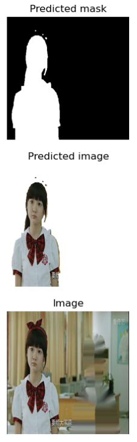  

 - Плохое понимание PIL внутри tensorflow(советую хорошо ознакомиться перед применением)

 - Оценка датасета на принадлежность для данной задачи(мой первый датасет состоял только из человека или фона, посторонних предметов не было. Итог: нейросеть выделяла еще и предметы сзади).
## Примеры из датасета
  
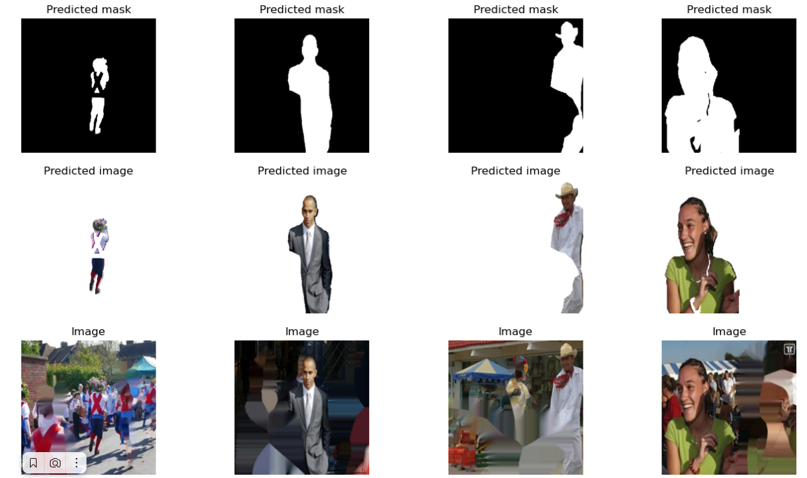

## Особенности датасета
Главной особенностью датасета является то, что в маске выделяют ТОЛЬКО человека, и его одежду. Из-за этого все предметы, которые находятся у человека
в руках, не отображаются нейросетью(такие как мобильник, микрофон, чашка и прочее). Кто-то назовет это слабой сторонной моей нейросетки, однако я скажу, что это фича, а не баг, ведь, во первых, с помощью этого можно заинтересовать стримерам аудиторию: "что у меня сейчас в руках???", а во вторых с помощью автоэнкодеров можно будет круто вставлять в это место различные другие предметы...

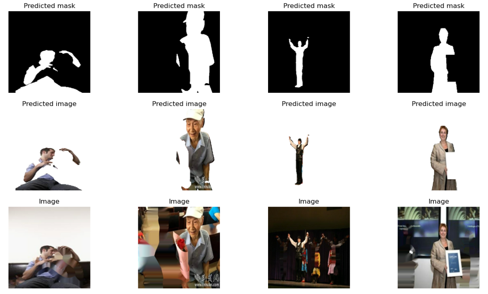

  Также, выделю такую особенность датасета, как превосходство в кол-ве изображений, где изображены девушки, поэтому нейросеть практически идеально
выделяет девушек, а также их волосы...
  Стоило бы отметить и то, что изображений в полный рост намного меньше, чем анфас.
  P.S. последние две гипотезы были сделаны на мой взгляд, полной 
аналитики по данным не было, да и не в этом была задача...
## Считывание изображений, их нормализация.
  Кот считывания изображений:

  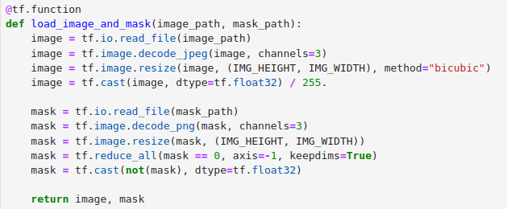

  Т.к. данные ограничены(range(0,256)) для нормализации достаточно было поделить все цисла на 255. Итог: дробные числа на промежутке от 0. до 1.
## Аугментация датасета
Код аугментации:  

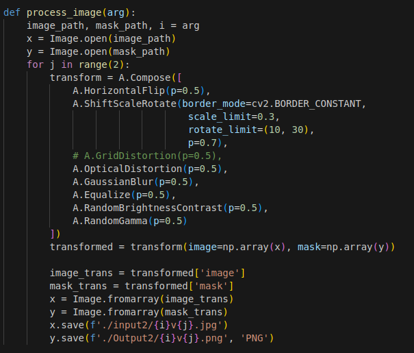  

Для аугментации я использовал такую библиотеку, как albumentations. Почему она? Возможность применения одинаковых трюков аугментирования сразу для изображения и маски + хороший выбор аугментационных трюков.
Исходное изображение и результаты аугментации:

  
  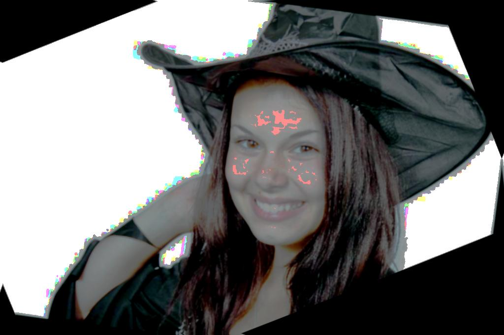 
  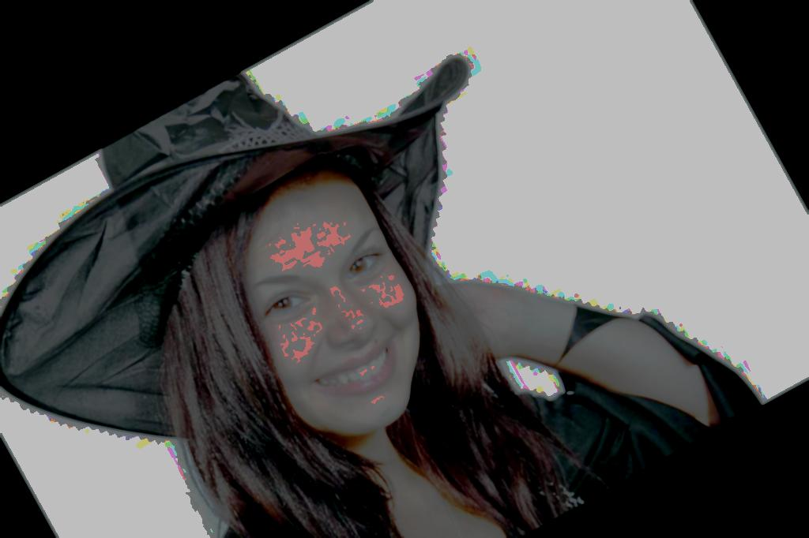

## Мультипроцессорность и многопоточность
При аугментации я использовал распаралеливание действий между ядрами компьютера(с помощью python-multiprocessing):
- Аугментация 30000 изображений на 1 ядре должна была работать за 40 минут
- Аугментация 30000 изображений на 12 ядрах(каждый работал на 100% работала за 3 минуты!!!

При обучении модели также использовал все мощности своего компьютера:
- Видеокарта GeForce GTX 1650(4 GB)
- 12 ядер компьютера

Бибиотека tensorflow позволяет использовать мультипроцессорность и расспаралеливать действия внутри видеокарты, однако для этого пришлось долго настраивать компьютер и сам код, т.к. tensorflow имеет большое кол-во костылей при первой его установке...

## Архитектура нейросети
Для сегментации использовал уже известную архитектуру deep lab v3+. Она удобна тем, что обучается достаточно быстро и имеет хорошую точность.  

Представление архитектуры:
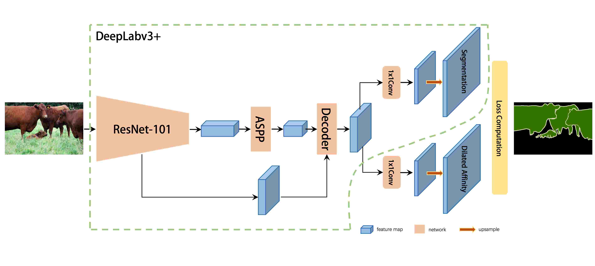 
## Обучение сетки
В качестве метрики я использовал BinaryIoU:

  

Лосс - bce_dice_loss(доработка бинарной кросс энтропии, которая кроме несовпадений учитывает еще и совпадения пикселей predict маски и оригинальной маски):

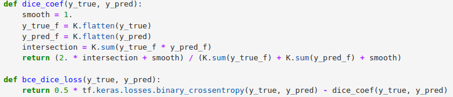  

BCE_DICE_LOSS = KOEF*BCE - DICE_KOEF

## Код обучения
  Ссылка на код обучения: [code](./src/peopdet.ipynb)
## Модель
  Ссылка на модель: [model](./DeepLabV3Plus)
## Как использовать мою модель?
  Ссылка на пример использования: [code](./src/model_use.ipynb)
## Результаты работы сетки

  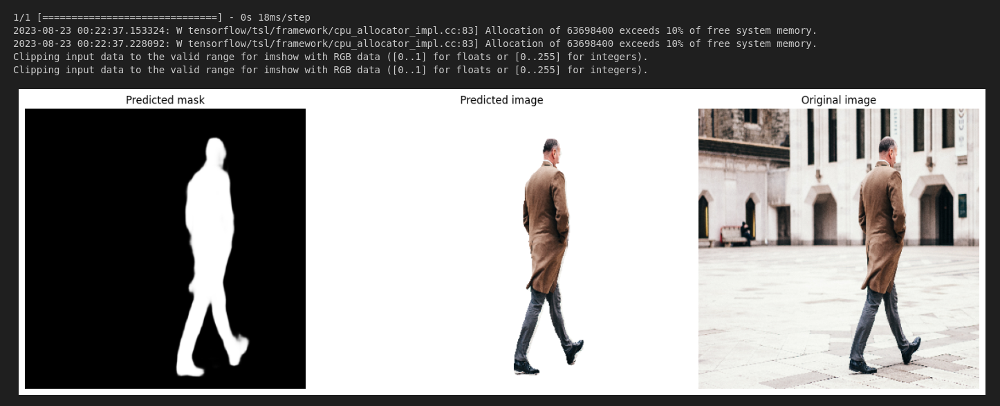
  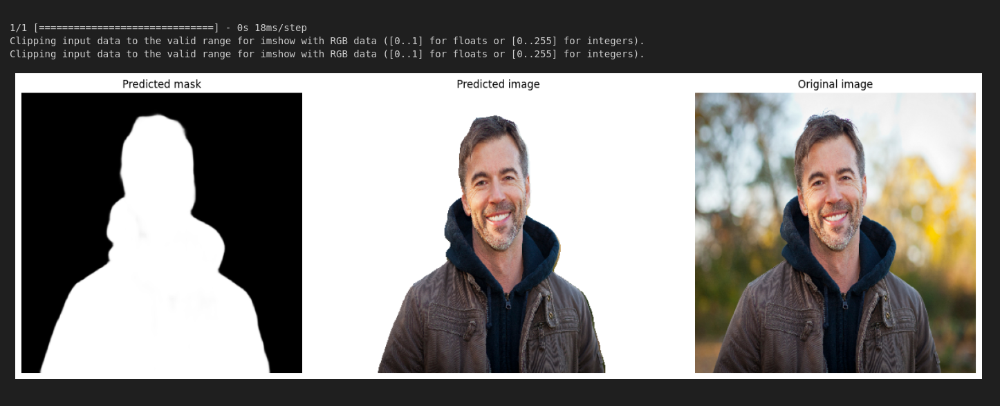

## Замеры по скорости и памяти(Сложность)

#### Для тестирования взял фотографии из нового датасета:

  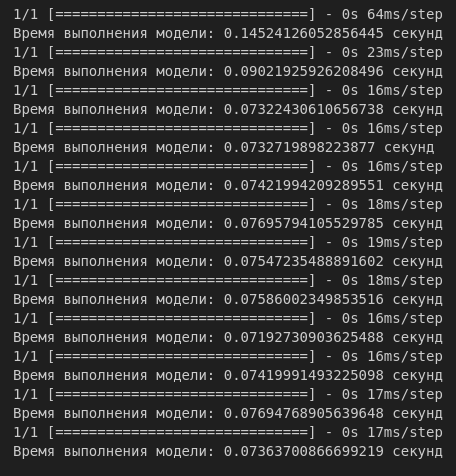 
  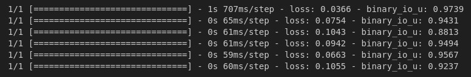

## Куда применить?
  Для полного погружения в компьютерное зрение я задал себе задачу: отделение человека(сегментация его) от фона.  
  Данная задача достаточно полезна в наше время: ведь, зачастую, при использовании веб-камеры, мы не хотим, чтобы кто-то посторонний видел, что находится сзади... Используем мою предобученную модель, по вкусу добавляем определенный фон сзади и радуемся: никто не видит, что сзади, да еще и фон прикольный :)  
  Также моя нейросеть подойдет, если требуется официальна фотография на белом фоне:
  - Нет белых обоев, а идти до ближайшей фотостудии далеко(да и еще деньги платить, хотя я и то лучше фоткаю...). Да и фотка есть прикольная, но фон далеко не деловой...
  - Не беда, моя нейронка без проблем отделит вас от фона, и оставит на вашей фотографии только вас красивых!
  Если включить фантазию, то можно много чего придумать, куда ее применить(включаем фантазию, анализируем примеры сверху, и идея готова).
## Особенности
Это не баг, это фича!!!  
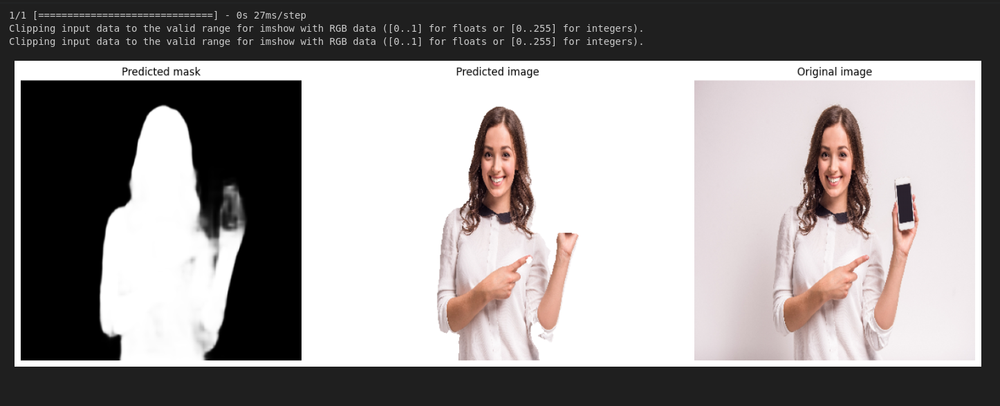  

Почему фича? Человек есть, а телефон обрезал... Это я описывал [здесь](#особенности-датасета)

## Существует большое кол-во подобных проектов, почему мой лучше?

- Первая причина - достаточно высокая точность:

- Вторая - быстрая скорость работы:

- Третья - большинство сеток платные, а мою достаточно скачать с гитхаба и поставить звездочку на данную статью)

## Вывод
Tensorflow удобная библиотека для обучения и применения нейросетей, однако для ее лучшей работы нужно долго и правильно настраивать не только саму библиотеку, но и драйвер видеокарту, cuda, cudnn...
Очень сильно на качество результатов влияет качество датасета, поэтому большое время пришлось уделить его оценке...
Правильный подбор параметров, метрик, лосса также роляет, поэтому уделите этому тоже достаточно времени.
Ну и наконец, отмечу, что данная работа помогла мне подробно изучить библиотеку tensorflow(это моя первая работа с ее использованием, до этого я писал на pytorch), так что, если вы хотите получить хороший опыт разработки, пишите больше проектов, так вы наберетесь ОГРОМНОГО опыта...

## P.S. если понравилась статья или хотите поддержать мой проект, то поставьте звездочку, чтобы я видел, что кому-то интересна данная статья)))