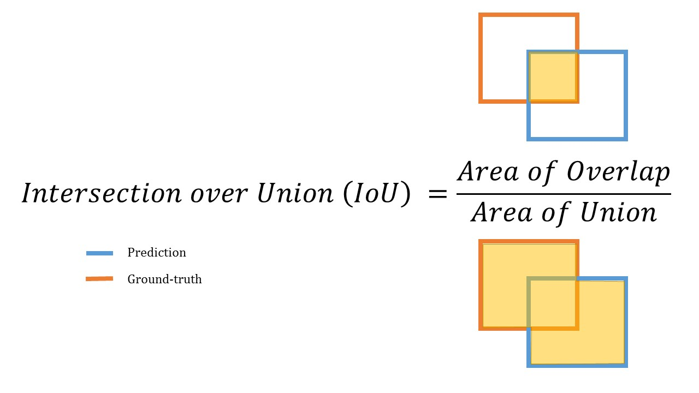

# Выделение человека от фона
## Цели
  Развивая свои навыки в области компьютерного зрения, я не смог устоять перед возможностью создания нейросети, которая будет отделять людей от фона на изображении. В интернете есть достаточно много(если хорошо искать) датасетов с сегментированными людьми(изображение и маска, на которых выделен человек).  
  Более того, данная задача имеет высокую практическую значимость, поэтому я принял решение о ее реализации и обучении нейронной сети, которая будет отделять людей от фона на изображении.
## Стек технологий(Python)
  - Tensorflow
  - cv2
  - PIL
  - matplotlib
  - sklearn(train_test_split)
  - albumentations
## Почему нейросеть а не обычные алгоритмы, которых множество в интернете?
 Сейчас на рынке уже существуют алгоритмы, при помощи которых можно отделить предметы от фона, например при помощи PIL.  
 Основной недостаток этих алгоритмов заключается  в том, что они сегментируют предмет на уровне градиента цвета. Поэтому для каждого нового изображени используются различные алгоритмы, а не один. По этой причине, такие сервисы  не могут обеспечить идеальное  выделение и  на конечном изображении все равно  присутствуют посторонние артефакты.  
  Нейросеть же выделяет более высокоуровневую информацию из картинки на каждом слое, поэтому в ней будет содержаться не только градиент цветов, но и пространственная информация изображения, и другие различные закономерности.  
  Таким образом, для лучшей сегментации человека алгоритмические методы создания маски уступают работе нейросети.
## Краткая история о сотавлении датасета
  Датасайнтисты знают, насколько сложно подобрать ХОРОШИЙ и КАЧЕСТВЕННЫЙ датасет, который идеально подойдет под решаемую задачу и будет иметь минимум погрешностей. Разрабатывая данный проект, я долго мучался с выбором датасета, подходящего к вышеперечисленным требованиям.  
  Собирая свой датасет для проектф, я столкнулся с такими сложностями, как:
 - погрешность масок(всвязи с тем, что, скорее всего, все датасеты сделаны вручную):

   

 - Плохое понимание PIL внутри tensorflow(советую хорошо ознакомиться перед применением)

 - Оценка датасета на принадлежность для данной задачи(мой первый датасет состоял только из человека или фона, посторонних предметов не было. Итог: нейросеть выделяла еще и предметы сзади).
## Примеры из датасета
  

## Особенности датасета
Главной особенностью датасета является то, что в маске выделяют ТОЛЬКО человека, и его одежду. Из-за этого все предметы, которые находятся у человека
в руках, не отображаются нейросетью(такие как мобильник, микрофон, чашка и прочее).  
Кто-то назовет это слабой сторонной моей нейросетки, однако я скажу, что это фича, а не баг, ведь, во первых, с помощью этого можно заинтересовать стримерам аудиторию: "что у меня сейчас в руках???", а во вторых с помощью автоэнкодеров можно будет круто вставлять в это место различные другие предметы...

Также стоит отметить, что в датасете содержится огромное количество изображений, на которых изображены девушки. Это означает, что у вас есть множество возможностей для тренировки и улучшения модели, которая будет выделять девушек на этих изображениях.  
Кроме того, наличие изображений в полный рост намного меньше, чем анфас.  
Также, стоит отметить, что последние две гипотезы были сделаны на основе моего субъективного мнения и полной аналитики по данным не проводилось, т.к. в этом не было необходимости.
###### Пища для размышлений: обучить сетку, классифицирующую пол человека, и дать более подробный анализ...

## Считывание изображений, их нормализация.
  Код считывания изображений:

  

  Т.к. данные ограничены(range(0,256)) для нормализации достаточно было поделить все цисла на 255. Итог: дробные числа на промежутке от 0. до 1.
## Аугментация датасета
Код аугментации:  

  

Для аугментации я использовал такую библиотеку, как albumentations. Почему она? Возможность применения одинаковых трюков аугментирования сразу для изображения и маски + хороший выбор аугментационных трюков.  
Исходное изображение и результаты аугментации:

  
   
  

## Мультипроцессорность и многопоточность
При аугментации я использовал распаралеливание действий между ядрами компьютера(с помощью python-multiprocessing):
- Аугментация 30000 изображений на 1 ядре должна была работать за 40 минут
- Аугментация 30000 изображений на 12 ядрах(каждый работал на 100% работала за 3 минуты!!!

При обучении модели также использовал все мощности своего компьютера:
- Видеокарта GeForce GTX 1650(4 GB)
- 12 ядер компьютера(AMD® Ryzen 5 5600h with radeon graphics × 12)

Бибиотека tensorflow позволяет использовать мультипроцессорность и расспаралеливать действия внутри видеокарты, однако для этого пришлось долго настраивать компьютер и сам код, т.к. tensorflow имеет большое кол-во костылей при первой его установке...

## Архитектура нейросети
Для сегментации использовал уже известную архитектуру deep lab v3+. Она удобна тем, что обучается достаточно быстро и имеет хорошую точность.  

Представление архитектуры:
 
## Обучение сетки
В качестве метрики я использовал BinaryIoU:  

  

Лосс - bce_dice_loss(доработка бинарной кросс энтропии, которая кроме несовпадений учитывает еще и совпадения пикселей predict маски и оригинальной маски):  

  

BCE_DICE_LOSS = KOEF*BCE - DICE_KOEF

## Код обучения
  Ссылка на код обучения: [code](./src/peopdet.ipynb)
## Модель
  Ссылка на модель: [model](./DeepLabV3Plus)
## Как использовать мою модель?
  Ссылка на пример использования: [code](./src/model_use.ipynb)
## Результаты работы сетки

  
  

## Замеры по скорости и памяти(Сложность)

#### Для тестирования взял фотографии из нового датасета(все замеры делались при помощи 1 ядра компьютер, без gpu):

   
  

## Куда применить?
 Задача отделения человека от фона является актуальной в наши дни, так как все чаще при использовании веб-камеры мы не желаем, чтобы кто-то посторонний видел, что находится позади нас.   Моя предобученная модель, основанная на методах компьютерного зрения, позволяет легко и быстро отделить человека от фона, добавляя на него заданный задний фон.  
 Кроме того, данная нейросеть может быть использована для официальных фотографий на светлом фоне, когда нет возможности пойти до ближайшей студии и получить официальный снимок.  
 При желании можно расширить функционал моей нейросети, добавив ей возможность автоматической вставки фона на заднем плане или вставки своих предметов в руки(с помощью детектора и автоэнкодера).
## Особенности
Это не баг, это фича!!!  
  

Почему фича? Человек есть, а телефон обрезал... Это я описывал [здесь](#особенности-датасета)

## Существует большое кол-во подобных проектов, почему мой лучше?

- Первая причина - достаточно высокая точность
- Вторая - модель была обучена на большом количестве данных, что позволило ей достичь высокой точности в отделении человека от фона.
- Третья - мой проект очень прост в использовании.  . Пользователям не обязательно владеть навыками программирования, чтобы получать отличные результаты, ведь все описано в [code](./src/model_use.ipynb).
- Четвертая - уникальность проекта: другие проекты могут просто повторять уже существующие решения, но не предлагать ничего нового.
- Пятая - прозрачность процесса обучения: для лучшего понимания процесса обучения и использования данной нейросети более эффективно, можно просмотреть мой код.
- Шестая - быстрая скорость работы
- Седьмая - большинство сеток платные, а мою достаточно скачать с гитхаба и поставить звездочку на данную статью)

## Вывод
Tensorflow удобная библиотека для обучения и применения нейросетей, однако для ее лучшей работы нужно долго и правильно настраивать не только саму библиотеку, но и драйвер видеокарту, cuda, cudnn...  
Очень сильно на качество результатов влияет качество датасета, поэтому большое время пришлось уделить его оценке.
Правильный подбор параметров, метрик, лосса также роляет, поэтому уделите этому тоже достаточно времени.  
Ну и наконец, отмечу, что данная работа помогла мне подробно изучить библиотеку tensorflow(это моя первая работа с ее использованием, до этого я писал на pytorch), так что, если вы хотите получить хороший опыт разработки, пишите больше проектов, так вы наберетесь ОГРОМНОГО опыта...
